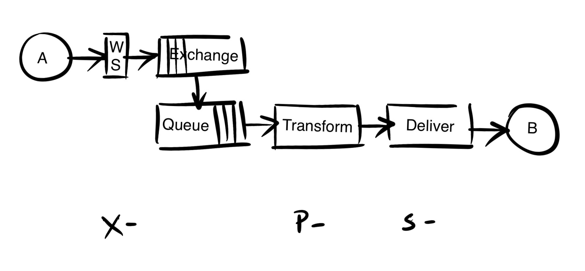

# ESB - Even Simpler Bus - A Simple, Efficient ESB for Integration Purposes
And why an ESB should not have API contracts!

[Download code](https://github.com/larspai/articles/blob/main/code/ESB_FrontEnd.zip) (Click the "View raw" link to start download)

In this article, I suggest publishing to happen through a generic web service. The routing is handled by RabbitMQ exchanges and queues, and subscription is done by consumers listening for messages on queues.
## Introduction
A couple of years ago, I wrote a number of articles on different aspects of the ESB (Enterprise Service Bus), the main purpose being to illustrate how little you need to implement in order to have a workable ESB framework. Since then, I have had time to reflect on the work process for integration engineers and engineering teams, and I have found that it would make sense to revisit the ESB and present an even simpler solution that makes the ESB an even more obvious choice and solution.
## The Plug-in Proposal
But why even bother with the ESB and custom code, when your ERP or CRM or whatever business system it is that requires an integration with another system, already offers a native plug-in, to solve this exact question? Well, in general terms, you should only spend development resources on processes that differentiate your company from others. Typically, for instance, your order-to-cash process will be very similar to that same process in other companies similar to yours, and typically this is where plug-ins may exist. And if a plug-in does exist for your purpose, I think you should consider using it.
However(!), you need to be aware that when you make the choice to use a plug-in, you are cutting yourself off from all influence on that functionality: you will not know - or be able to decide, when the plug-in is invoked, and you will not be able to customize the data that is affected by it. In my experience, even the most standard integration between the most common business systems, turns out to be not entirely standard after all, or in other words: very shortly after having installed the plug-in, you get a requirement in your process that you just cannot accommodate with it. You will find that making changes to your strategy at this point in time will be both expensive and frustrating.
## The ESB Solution
I believe in setting up a simple, but efficient ESB, for integration purposes. The general characteristics of an ESB are described in my earlier articles, here it will suffice to say, that an ESB is a publish-subscribe pattern implementation: Messages from a system is published to the ESB and one or more systems subscribe to these messages and consume them as they appear. The ESB becomes the switchboard where most business system event data is available in real-time.
## The Development Process
In most cases, integrations are driven by one system needing to know about events taking place in another system: The ERP needs to know about orders, invoices and credit card payments made in the ecommerce system; the ecommerce system needs to know about wire transfer payments registered in the ERP, etc. Therefore, the investigative work often starts by finding out, which event may be triggered in the source system and what data can be provided. Typically, this is the easy part actually. Engineers working with the source system or integration engineers will determine this, and the system will make a callout to some URL provided by the ESB, with a message containing the data, typically either in XML or json format.
## The API Contract
This URL/end-point/receive location - or whatever you want to call it, should, for the vast majority of systems, be a web service, and it is the point of this article, that this web service should be completely generic and able to receive any message of any content! With this in place, you will not need to make another API - at least not for the ESB, and you will only need to give access to it to add new publishers.
Public APIs used by developers to interact with a business system, like the ones you will be using when the data published on the ESB is to be inserted in some destination system, have very strict contracts describing the required payload in great detail, for instance by use of Swagger or OAS, and received payloads are validated against those specifications. This makes a lot of sense: these APIs are methods to read, insert, update and delete objects in that particular system - requirements for the methods are clear, and contracts should and will exist.
In the ESB context however, the situation is pretty much the other way round: The mindset should be that the data is published without one particular purpose in mind. In practice, the first integration that requires the data may appear to be the particular purpose, but conceptually, it is just another consumer or subscriber. The data will be consumed by potentially many different subscribers. In the ESB context, the source defines the contract, and it is the key point here that the ESB end-point, the API, will not and should not have one.
## No Contract API Design
This is an opportunity to make an exceptionally lean and efficient end-point, for systems to publish data on the ESB - and the source system can pretty much create the URL it wants, as long as it hits your service domain:
In an earlier article focused on routing, I suggested an endpoint URL construction reflecting the source system and the message type. The point was to create a receiving web service that would only receive the message and publish it to a message queue. The source system would be used to determine the exchange that the message was to be published to, and the message type would be added as routing key for the message. In the mentioned article, I have suggested using RabbitMQ, a recommendation that I still support, although the pattern of course would work with other brokers as well, like Kafka or Google Pubsub.
However, the source system need not be part of the URL as it may be identified through its credentials. Routing should be determined by the identified system and on the routing key found in the URL - a key that would preferably express what kind of data the message contains. The URL path may thus be simplified to only contain the routing key, i.e., https://localhost/order.
## Correlation Id
With the composite architecture of an application/integration with the ESB and services approach underneath it has, it is strongly suggested to add a correlation Id to the message header, before publishing it to the message broker. This will provide a way to tie logged payloads and error messages together, a requirement that only becomes more important the more complex the integrations are. I have discussed this in an earlier article as well - I think it is still worth a read.
Note that back when I published that article, I did not consider NodeJS to be production ready. I do now.
## ESB Design
As mentioned above, the ESB implements a publish subscribe pattern. In this article, I have suggested publishing to happen through a generic web service. The routing is handled by RabbitMQ exchanges and queues, and subscription is done by consumers listening for messages on queues. The components may be illustrated like this:

As this article has only been focusing on the publishing part, the included code project only contains a web service to provide the discussed end point. One of the beauties of the ESB pattern is that the consumers may be created in any language or tool, like Node, Go, Kotlin, C#, Mulesoft - basically anything that can read from the queue, do the necessary transformation and deliver to the destination. The delivery may even be handled by its own component as illustrated, so that you may only have one component delivering to each destination system, and thus only one component having the relevant credentials to interact with that particular system. This would be consistent with a three layer design, letting our receiving service be the experience (x-) layer, the consumers be the transformation or processing (p-) layer, and the delivery services the system (s-) layer.
The layered design is discussed well and in more detail in this Mulesoft whitepaper. You will find my recommendation here to differ significantly on the x-layer role, as my point is that the front end of an ESB is not an API as such.
The drawing below illustrates how the components may depend on each other. The example suggests that system A publish data that is consumed by system C, and system B publish data that is consumed by both systems C and D.

## Web Service Requirements
The requirements for the web service can be listed as follows:
- It should be agnostic to the received payload (but you might choose to convert to i.e. json so that all published messages are same format).
- It should require authentication and route messages according to the publishing user.
- It should not need to be redeployed to support new publishers.

These are the requirements that the included web service application implements. To on-board a new source system, all that needs to be done is to create credentials for it. With these in hand, the source should be ready to publish messages to your ESB!
## The Code
The attached project is a node application. It uses RabbitMQ as message broker and stores users (and exchange configuration) in Mongodb. I suggest that you run these locally, i.e., in Docker.
The project only includes the source files, so you will need to create an express application, unzip the project into it, and run npm install before you can start it.
Users are defined in the users collection. The individual documents only contain name, password and exchange (for use on RabbitMQ) - I have provided an export of the testusers I have used.
To see the application do something, you will need to POST a message, with a body, to a URL similar to the one mentioned above (http://localhost:3000/order) and set the content-type to either application/json or application/xml.
Notice that if you successfully post a message, the application will have created the configured exchange, but as there is no queue bound to it, the message will not be found anywhere. Create a queue, bind it to the exchange (i.e., routing key #) and send another message. This, of course, may be solved in the code, by always creating a dump queue when creating an exchange, but this really is a design choice.
