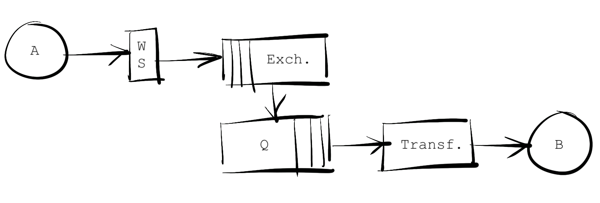
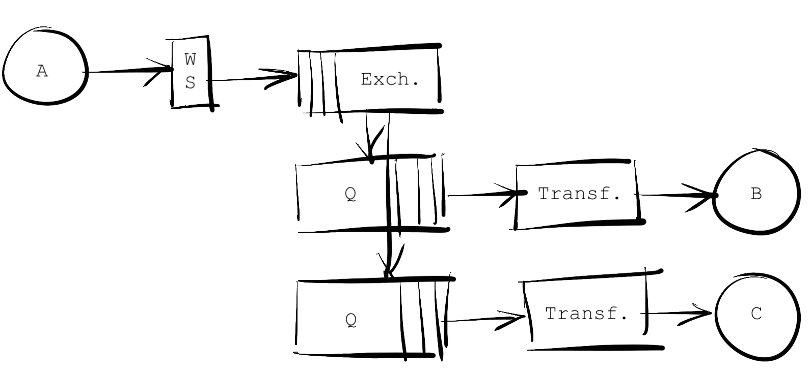
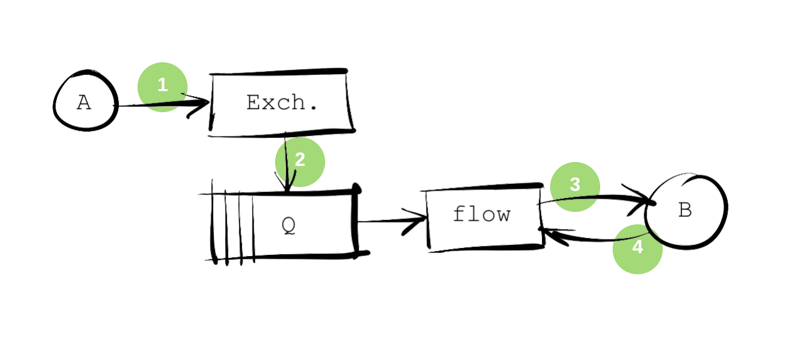
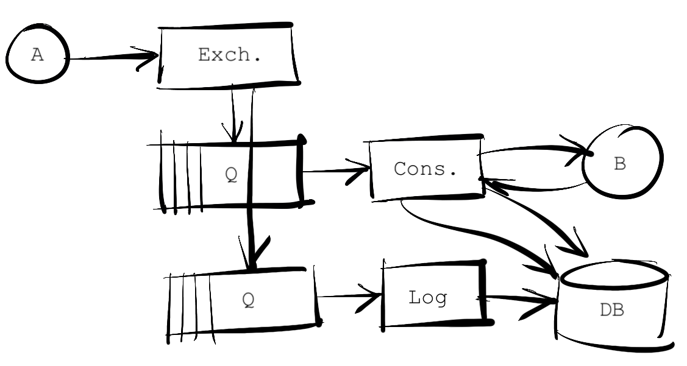
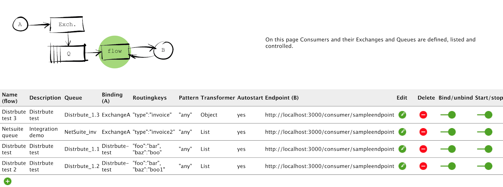
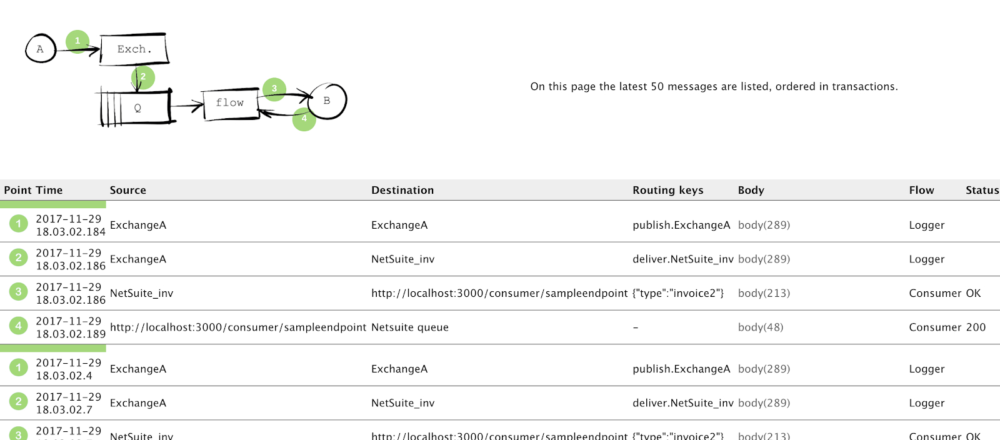
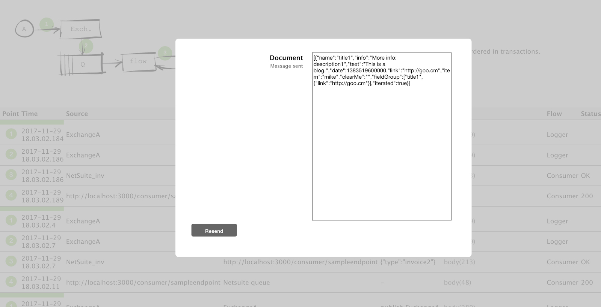
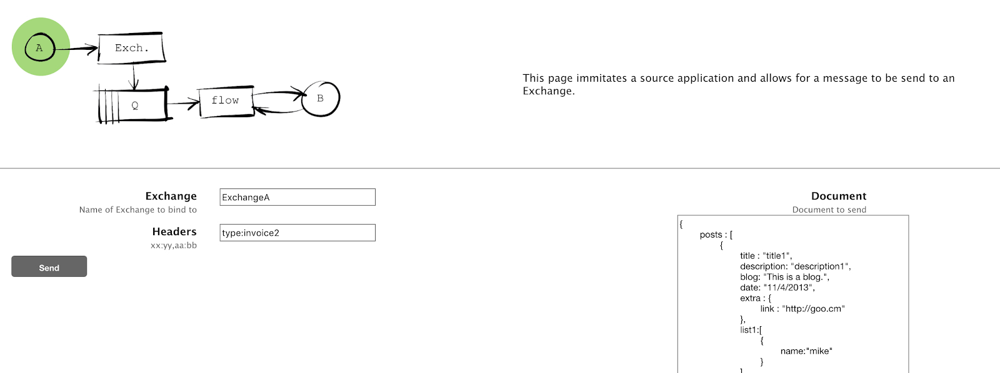

# ESB - Logging and Monitoring

First published 12 Feb 2018

[Download code](https://github.com/larspai/articles/blob/main/code/distrbute.zip) (Click the "View raw" link to start download)

## Introduction - The Scope

While implementing an ESB is not too difficult, it is often forgotten to produce a reporting framework around it, to allow its stakeholders to see exactly what transactions are flowing between the systems, what data was actually sent and what was received. This is, however, a rather important component, both for you (for debugging and for exposing and advertising your service), for the users/stakeholders, but not least in a compliance/control/audit context.

Similarly, the requirements for monitoring the health of the various integrations of an ESB are not necessarily stated, often leading to a very unclear understanding of whether the ESB is running and doing something useful.

This project was created to demonstrate how the most basic reporting requirements may be met, but is, at the same time, a simple introduction to what an ESB is.

And rather than to just speculate on how to, it presents an ultra tiny ESB application, to allow for all the implementation practicalities to pop up.

## The ESB
There are many reasons for implementing an ESB. One is to ease messaging between systems of different types, by creating an abstraction layer where data publishers and subscribers/consumers can meet and exchange data. The abstraction is about allowing more systems to publish the same type of data (say an order or an invoice), and to have more systems subscribe to the same data.

The biggest advantage of using products like Mulesoft and BizTalk is the adapter packs they provide - the ability to connect to a number of the large and common business systems, ERP, CRM and HR systems like SAP, NetSuite, Salesforce, Workday, etc. right out of the box.

It can take some time to get the connection to a system to work, as business systems (not least SaaS systems) have their interfaces put together to best meet non-functional requirements like security, load balancing, performance, etc., but once you are past that barrier, your connection solution can be reused for your next integration with that particular system, and typically, it's not that difficult - the documentation for making these connections often are extensive.

However, in an enterprise context, the biggest driver for selecting a standard software with standard connectors is not technical, but is about compliance and auditing. If you have a commercial connector, an auditor will not ask questions about it, but if you made it yourself, you will have to verify that there are no dependencies (and thus possible violations) on commercial libraries, etc.

So while the technical implementation may seem fairly straightforward, legal compliance will play a prominent role when choosing technology in an enterprise context.

But that is not my concern here, so let's round up what an ESB should do, what the requirements are.

The main functionality, of course, is for systems to be able to publish messages - post data - to the ESB, and for other systems that are interested or dependant on that data to subscribe to these messages and have them delivered in a suitable format. The functional requirements may be formalised as:

- ESB is real-time integration
- ESB implements the publish-subscribe pattern
- ESB flows are asynchronous (meaning - among other things - that there is no guaranteed delivery sequence)
- ESB flows are one-way (meaning there is no synchronous answer to a delivered message, except the one telling that the message was consumed by the ESB)

In more architectural terms, the ESB must offer:

- a receiving location
- a routing mechanism
- transformation mechanism(s)
- a delivery mechanism

Some ESBs (e.g., BizTalk) operate with transformation on the way in (to an internal, canonical format) and transformation on the way out. As it is basically the same thing happening twice, this can be modelled by the same components.

The sample application will implement the above components. In more detail, the ESB application will consist of:

- A web service to receive messages
- Queuing/routing
- Transformation and
- Delivery to an external web service

A part of the problem solved by most ESBs is that messages coming from different systems may be in all kinds of different formats: XML, JSON, binary, proprietary, etc. As most systems can deliver data as either XML or JSON, I’m going to narrow the scope to the least possible and concentrate on JSON messages. JSON messages coming in, and transformed JSON messages going out.

## Design
In order to produce a simple application, I will use NodeJS as my coding framework, RabbitMQ for queuing and routing and Mongodb for storing configurations and logging. These are suitable choices for a demonstration project - not for production. More on technology choices to come.

Design decisions:

1. The Web service will accept any payload. Routing keys and descriptive (message type) data will be provided in headers:
2. Routing will be based on key:value pairs according to amqp header consumer specification
3. Mime-type: json
4. Routing will use RabbitMQ to define an exchange for every source system and related queues for every subscribing system.
5. Consumers will be defined as records in a database and instantiated as consumers implemented in NodeJS. Consumers will be able to transform messages according to a template defined for it, and to deliver the message to an http endpoint.

All logic will be running in the same NodeJS application, which will expose the receive-location web service as well as instantiate the consumers as they are defined in the database.

So the basic functional design (what the application will look like at runtime) will be like this, for a single source application publishing messages consumed by a single destination application:

Figure 1. ESB components

The figure shows a source system (A), the RabbitMQ routing (Exchange and Queue), the transformation (Consumer) and the destination system (B).

Figure 2. More consumers

The point of the ESB is the ability to allow more consumers to consume the same source data. The routing will create separate message instances for every consumer, thus the consumers are separated logically. In my case, the consumers will be instantiated in Node. In enterprise level applications, this component typically will be Mule flows or similar. And this is really a beauty about the pattern: Consumers could be created in different technologies and coexist without any problem, except from the monitoring and managing challenges, this would create.

My choice of NodeJS as application framework makes sense for the parts that have to do with presentation and management, but the single threaded nature of NodeJS makes it very ill suited for the consumers part, as this will create dependencies and vulnerability across the consumers. One consumer may take the entire program down and take all other consumers down with it.

For demonstration purposes, I will create and include a consumer application in Go, which has a completely different threading model and is much better suited for this purpose. In an enterprise setup, you would probably like to ensure the encapsulation of the individual flows even more, like packaging each flow as a stand-alone component, complete with its own runtime environment. In Mule 4.0, it is possible to run individual flows in their own Docker container, effectively preventing one flow from jeopardizing another.

## Logging
The above ESB design will receive messages, distribute them, transform them and deliver them to their proper destinations. It will however not log what came in and what went out - the requirement mentioned in the introduction.

The basic requirement to satisfy enquiries from system owner stakeholders is to be able to log the message that the source system delivered as well as the message that the destination system received. For debugging reasons, it may be relevant to log states of the message at points in between these two messages, and it may be well worth logging the response from the destination system upon delivery - if such a response is given.

Figure 3. Relevant points at which to log messages

To produce a logical presentation of all the messages initiated by the message coming from the source system, it makes sense to think of the logged messages as belonging to transactions, one transaction causing a number messages (four in the our case) to be logged.

To accomplish this logging, messages will be written to a database at these four points. In practice, the messages in the routing part (exchange and queue) will be logged by use of standard rabbitmq functionality - tracing. Rabbitmq implements tracing by means of an extra queue that receives a copy of all messages and logging is simply writing these trace messages to the log db.

Logging in the transformation part is implemented by letting the consumer flows write to the log db at relevant points.

To tie everything together, a correlation ID is added to the message header by the receiving web service.

Figure 4. Logging components
## Database
Messages should be logged with all relevant metadata to be able to present it in its correct context. For this, a database table to hold logged messages might contain the following fields:

- Timestamp
- Correlation ID
- External message/transaction ID (if one such exist)
- Source (where is the message coming from - exchange, queue, transformation flow, destination system)
- Destination (where is the message headed)
- Routing keys
- Headers
- Body (the message!)
- Flow name
- User (if known/relevant)
## Presentation
With all the messages in the log database, all that is left is to produce an interface for the users to search and display the transactions that are of interest to them.

User interfaces are a discipline of its own and the test application implementation is a fairly naive example of what this could look like. It consists of three parts which can be navigated between by pointing and clicking on the model drawing:

1. A page to set up consumers, defining routing keys and transformation templates, etc. The transformation logic could be implemented in many ways, in this case, the node-json-transform library was used as it offers a simple way to handle even complex json documents.

For demo purposes, this management page allows the user to stop a flow without stopping the subscription, thus messages to the destination system is queued up until the consumer is restarted, which is a very useful feature.

2. A page to show the latest transactions.
This is where users should be able to search for transactions going out of, or into their system, with a given ID or at a specified time.

The test application only offers a view of the latest 50 transactions(!).

From this page, the actual message payloads may be displayed and even edited and resubmitted - a feature that probably should be given only limited access to.

3. A page to simulate a source system and thus to create transactions.

As can be seen on the screenshots above, a few additional features have been implemented, but basically the presentation of message data may take any desired form.

## Conclusion
This demo application is an example of how ESB messaging may be documented and documentation made available to users, by simple logging in the routing and transformation mechanisms. These mechanisms may be components very different from the ones used here, and options may vary - the principles should however remain the same.

## User Manual
In case you choose to download the included application an run and install it, the following instructions may be useful:

When the application is first started, there are no consumers and thus no logic to process incoming messages. As a matter of fact, as long as there are no consumers, there are neither exchanges or queues in the routing RabbitMQ component, as these are defined by the consumers. Thus first step is to set up at least one consumer.

When the application is started and (assuming the application is running locally) the browser is pointed to http://localhost:3000/, the flow page will appear. Click on the plus sign at the lower left corner, to add a consumer.

In the consumer definition window, add a flow/consumer name, a description of the flow, a queue name and a binding - which is the name of the exchange that the source system will send its messages to, one or more routing key:value pairs, a matching pattern ("all" or "any"), an indication of whether the Jason it will receive will be lists or individual records (type "List" or "Object"), a destination URL and translation template according to node-json-transform. Finally, you can set up whether the transformer should autostart ("yes" or "no") when the application starts or restarts.

When the consumer starts, it will create the exchange and queue if it does not already exist. Therefore, it is now possible for the source system to post a message to http://localhost:3000/exchange/“exchange-name”, with the appropriate routing key-value pairs as a header and have the message routed to the consumer and the message payload processed there.

Whether successful or not, the message should be logged at least in the routing component. If successful, the message should be logged also in the transformation consumer.

For test purposes, a sample web service has been made that will consume any payload and return a message containing the length of the consumed payload. The address of this service is http://localhost:3000/consumer/sampleendpoint.

Sample templates and data can be found at node-json-transform's github pages.

Notice that the application is demo standard: you may have to look in the code to understand what to do!
