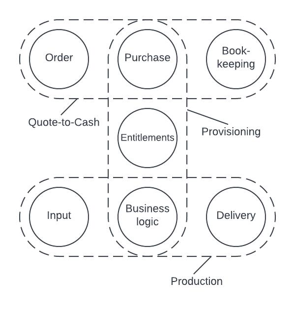
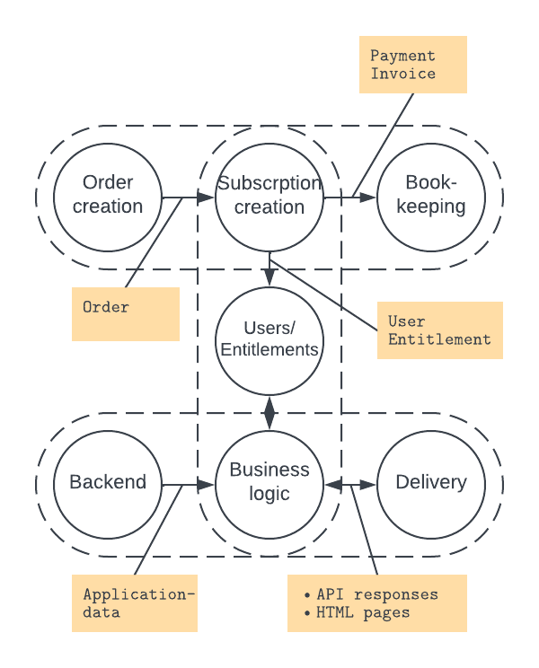
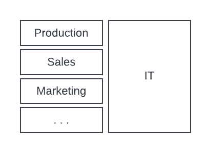
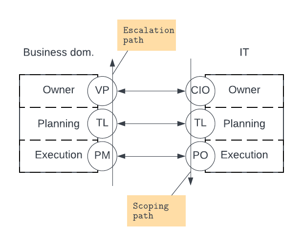

# Enterprise Architecture Value

First published 27 Mar 2024

An approach to enterprise architecture that is less concerned with tooling and complex model building and more with what creates value short- and long term.
## Introduction
In the past 15 years, I have been working with Enterprise Architecture in a number of ways and with different responsibilities. A lot has already been said about EA obviously - it is a formalised professional field, and there are lots of methodologies, frameworks and tools out there, as well as proper education and certifications to be had. In this article, I will describe how I think about Enterprise Architecture and how I have been working with it, to describe where and how I think it provides the most value. 

My professional path started in programming and my approach to enterprise architecture is formed by initially understanding things in an IT context. As it turns out, IT is often the place where business processes are most formally described, and since IT is typically responsible for supporting the entire business, it is also often the place where the most complete understanding of the entire business can be found.

This is an underestimated and underexploited fact. Often processes are approached from a single stakeholder perspective, often with little or no understanding of the larger context. This is a no-enterprise-architect-approach, and to establish a reasoning for the enterprise architect role - the burning platform, let’s take a short detour out in the real world to see where that can lead:

In a large company I once worked for, the CRM system was configured by a lead sales representative. For this reason, the customer account model was not created with any thought of how it would relate to customer accounts in other, related systems, like the subscription system or in the ERP system - or for that matter how it would fit the account management in the product we were selling. Instead, it was created to support a bespoke bonus model that would provide the most bonus to most sales representatives possible, splitting account ownership in geographical areas and industrial sectors.

This meant that it was not possible to calculate precise measures for churn or acquisition cost and it was impossible to tell how the sales organisation was performing as a whole. (Perhaps somebody should have reacted to the fact though, that we had roughly the same number of sales representatives as we had enterprise size customers).

For the very same reasons, we never had a proper conversation with our large customers about what they would like from our product, what licensing model would suit them, what they thought about the pricing of our product, etc. The sales department was working as if they were selling garden tools in the eighties - effectively supported by the CRM system, and this behaviour created vast earning difficulties long term - and a nightmare when trying to create datasets for reporting, and not least when implementing automation logic for the sales process.

The company was not able to clear up this organisationally inflicted mess in the several years I was there, because the origin of the problem was never recognised.

While it was not clear to me at the time, it is obvious that designing this account model exclusively to support the sales process, is bound to cause problems in the larger context of the Quote-to-Cash process, where orders in the sales system need to somehow tie to accounts in a provisioning process and further on when the sales are posted in the ERP system (that is, of course, if you have customer accounts in the ERP system). Mind you, this is not a simple problem - the question of bonus calculation still has to be solved, but at least you need to be aware of all requirements, in all scopes, when you start designing.

The different scopes and dependencies between processes and models is not likely to be clear, present and understood in any other place than IT - and even there, it requires a role that is responsible for creating the larger picture and understanding the proportions of requirements. The Enterprise Architect.

## Enterprise Architecture?
The common understanding of what enterprise architecture is - and my own understanding until only a few years back, is that it is about how IT can best support the enterprise business. We are however far into the age of digitalisation, and in the time I have worked with enterprise architecture, IT has become an inherent, inseparable part of all key components of the enterprise. Therefore, Enterprise Architecture starts in another place and is more about Product, Business Processes and Organisation and then IT. In the following sections, I will dig into this, to see where enterprise architecture value is found.

## Enterprise = Product
All enterprises have a product or more products which are the reason for the enterprise to exist in the first place - their raison d’être. So at the absolute centre of the enterprise is product. The most important thing about product in enterprise architecture context is that the enterprise should have a process for ideating, innovating, developing or in some other way evaluating the product, and the enterprise architect should be part of this process. Not so much to participate in shaping the product, but in order to understand where it is going, as this may have profound influence on all other processes in the company, the business processes, the organisation and on the IT required to support it all.

If such a process does not exist, the enterprise architect should take on the responsibility to initiate that it is created. Basically, this is strategic leadership domain and the leadership should ultimately own and drive it.

A proper product conscience is of course essential to protect the enterprise position. History is full of examples of companies that failed to innovate on their product and lost their position as a result.

Thus in very short terms, the first question the enterprise architect should ask is: what is our product - and what would we like it to be?

Tightly coupled to this is the delivery. Making sure that the customers get what they have purchased, and that it is actually delivered - I think of it as the provisioning process.

Obviously, this may, in many cases have an impact on the product itself. Some products are tightly coupled with the delivery of it - this is the case for most digital products like a storage service or a simple website, while others are less so - think of physical products, like foods or furniture.

The enterprise architect may have a very direct stake in this provisioning process, as architecture may play a central role in the choice of digital delivery method, or in automation of a more complex, possibly partly manual process.

With these processes in place, it is time to take a step back, to get a grasp of what the bigger picture looks like. Apart from the sales, production and provisioning processes, what other business processes are necessary, and how does it all fit together? In one of my favourite books on enterprise architecture, “Enterprise Architecture as Strategy” by Jeanne W. Ross, Peter Weill and David C. Robertson, they describe how a model for this may be built. They call it the “core diagram” for the enterprise. Ideally, this diagram should be created in cooperation between all key stakeholders in the enterprise and it should describe how the business works, identifying all the most important components and services. If this cannot be achieved, the enterprise architect must create one, as this diagram will inform all other enterprise architecture related discussions and decisions.

To me, there is a priority in the core diagram: It is more important to understand the product and customer relation than the internal mechanisms of the company. So in my opinion, the model for the product/production and delivery/provisioning comes first. Everything else is supporting processes (think Porter's value chain). The provisioning obviously ties to the product on one end, but it also ties to one or more sales processes on the other. Similarly, the production process may relate heavily on sourcing, storage, logistics, quality control, laboratory work, etc., and consequently these processes may need to be represented in the model as well.

Thus, in short:

- Understand your product and where it is going. 

- Make a drawing to illustrate the product and its customer relationship (put it on the ceiling over your bed!). This is all about how to direct as much effort in the enterprise towards the product as possible. Ultimately, this is where the value in the enterprise is created.

We all have a tendency to believe that what we do is the most important thing in the world (slightly exaggerated). Keeping everybody’s eyes on the product and keeping proportion in the perceived importance of things will prove to be productive.

## Business Processes
About ten years ago, I created a very generic business process model that fit with the company I was in then, but as it turned out later, one that would be usable in many different companies. It is simple, but it provides a good example of how processes can be understood, and how a simple model can separate different duties and tasks, and offer clarity of where different functions and systems fit and what their boundaries are. Identifying key domains and functions makes it simpler to understand why different systems are needed and why these systems may require their own data model.

To go back to the account example, the customer account model needed to describe the customer to the sales representatives, is not the same as the model needed to provide a consistent billing experience in a subscription system, and they are both different from the model needed to post and keep books on the sales in the ERP system. In short: the CRM system will need a customer account model that describes different layers and relations in the customer’s organisation - headquarters, local offices, subsidiaries, contact persons, etc. A hierarchical structure. The subscription system will need accounts for billing and tax - few and not necessarily related. A flat structure. And similarly, the ERP system will need accounts for posting income in different currencies. Probably even fewer accounts and also a flat structure. 

The business systems each have their own databases, and their customer account objects likely will not support the same relations - some may not even be able to produce a hierarchical model. Instead, they are tailored to support their specific needs - their way of understanding the customer account concept. This will be true to other object types as well, like orders, subscriptions, pricing, payment plans, etc.

I call my simplified model the standard-H, albeit the H is lying on its side. It looks like this:

Generic business process model

However overly banal or simplistic this model may seem, I think it is clear how it will make it very obvious what components go where and where different processes and personnel groups operate. It is not exhaustive in any way, and that is not the intention with it either, but it (or a similarly simple model) will be extremely strong in putting everyone on the same page and able to discuss complex matters in a common context. 

From this model, it is easy to start circling in different teams or departments, and if you think about IT support, the boundaries of systems are emerging.

So let's think about IT for a moment here - it will lead us back to the discussion of what enterprise architecture is:

Suppose you run a SaaS company, you may already start pinning out what sort of data needs to run between different parts in the model - and different parts will likely be represented by each their own system. You can even get an idea of the integration types required between components (BTW: check out my article on relation between business processes and integrations):

Likely data interchanges

This approach to integration architecture seems logical from an IT perspective, but it is not necessarily so logical when you look at it from the business point of view. The business will rarely have a discussion with IT that includes a perspective as wide as this. When solving their tooling requirements, they typically will not have a discussion with IT at all initially. Instead, they will look around for systems that they believe will solve their domain challenges, and the vendors of these systems will tell a story that is very far from architectural considerations - something along the lines of: “This need not even involve IT! There are standard plug-ins to integrate Salesforce with Zuora or Aria or whatever systems you are using, etc. etc.”.

These differing understandings actually are at the heart of this article.

While there is a SaaS vendor driven agenda suggesting that IT is becoming a commodity, promoting configurable, no coding software, standard integrations (“you can just plug our software into your existing system landscape”) and in the worst case have code written by AI, the fact is actually the contrary. IT, automation and intelligence is eating its way up the value chain and has long been an inseparable part of all ends of the enterprise. Code is everywhere, and everywhere you have a differentiating process, that code will be custom. The uncomfortable fact is, that dependency on code and IT has only just begun. IT is no longer a supporting service of secondary importance, it is a prominent driver to the enterprise future and the place where most competitive advantages are likely to be found. This has been obvious to many companies for years, but equally many companies believe they have realised this, however without letting it have much consequence - turning their backs to the scary but required restructuring. Some companies haven’t realised it at all.

The times where the CIO would refer to the CFO are over.

One thing to note here is that “differentiating” is not the same as “differing”. Differentiating processes are those that make your company different from others from an external point of view. They may be direct selling points to your customers. This is where you want to put your efforts and money.

All other processes should be standard, and if they differ from standard, you should look into why this is. In many cases, a lot can be earned - or saved, by assimilating a standard process, rather than trying to build custom logic to support a custom process. Differing processes rarely produce value.

Still differences may be imposed by external factors like regulatory obligations or tax regimes, and you may not have the choice to assume the standard. I have experienced a company choosing an ERP system that supported the bookkeeping standard in the country where the finance department was situated, but that did not support the reporting requirements in the country where the company was registered. That proved to be a nearly fatal decision. And very similar to the example with the CRM system above, this situation was caused by letting the business - in this case, the finance department, be responsible for selecting the ERP vendor. I believe they should have discovered the system's radical shortcoming to their requirements as this was all inside their own domain, but they were not able to produce a proper selection process that would describe and register their requirements and make sure the selected system would meet them - however obvious it seemed. Something that will take place in most IT departments regularly.

Two ERP migrations back to back have taught me that even though you just did an ERP migration, you cannot do it in less than a year(!). Simple decisions on financial account structure and revenue recognition can lead the project completely astray - in our case, only extremely cautious and clever colleagues in IT made it possible to reload consistent sets of transactions several times (on the fly!) and ultimately allow the company to make correct annual reports only just inside the relevant deadlines.

While financial processes shouldn’t differ much from one company to the next, in this case, selecting a standard process provided by the ERP system proved to be the wrong decision - because the reporting requirements were not “standard” in the SaaS provider context. (In other words: Buying into the SaaS providers agenda about standard plug-ins and no code configurations, may well lead to a very vulnerable or even critical place). In this case, the selection was driven by the wrong requirement, and they should have opted for a system that had a slightly non-standard posting process, but that was able to make the required annual reporting in the required way.

My conclusion on these miserable experiences is that vendor selection and even system configuration cannot be left to the business. To cite the beginning of this article “[IT] is also often the place where the most complete understanding of the entire business can be found”. The business owners are still subject matter experts on the individual process component or functions, but they cannot own the process. In my opinion, a body in the IT organisation should lead these processes, obviously including the relevant business owners and other stakeholders. That body should be headed by the Enterprise Architect and likely include solution architects and/or business analysts.

To rephrase it: These processes cannot be driven by business organisation first and then IT. They are Enterprise Architect domain, and they must be driven by IT first, then business organisation. This is the new paradigm. The business process rules and the approach perspective must include the entire process and not only needs in a single, albeit central business function. IT first.

- Make a simple model of the key business processes. Always use this to contextualise discussions on organisation, system boundaries, data flows, etc. The diagram to rule them all!

- Think IT first when designing processes - IT is your executing systems and the glue between them - it has to work

- If a process is not standard, find out why - and correct it

- Identify the differentiating processes and spent your money and efforts there

This is all about tuning the enterprise, to become the most efficient, product centred machine possible. Having a common understanding of how the “machine” works, will make cooperation much smoother. Common efforts may even seem meaningful at times!

## Organisation
Organisation is a leadership and management issue, but one that could, and should, be informed by the core diagram or the map of business processes drawn by the Enterprise Architect. This is rarely a question of building an organisation, but about rebuilding or revising an existing one, to better fit the work that is to be done. It is also a daunting task that requires a lot of courage and belief in the analysis of the enterprise - so that is where it starts: The leadership has to be on board with the understanding of the enterprise as it is expressed in the modelling of the business processes. If such an agreement can be established, the leadership will without any doubt ask itself, if the organisation properly reflects the model. If the leadership cannot agree to the model, they should engage in determining what the model should look like - basically the process leading to the core diagram as described in “Enterprise Architecture as Strategy” mentioned above.

If leadership agrees to the model, but finds that the organisation does not properly reflect it, organisational change is required.

These organisational steps are mentioned here, because they are probably the most important building blocks in the enterprise architecture and they need to be in place for the enterprise to function properly - and because they are prerequisite to the subsequent analysis of the IT requirements. In a sense organisation IS enterprise architecture more than anything - the people working in the enterprise are the enterprise, but the modelling and implementation of the organisation is a leadership task (effectively making the leadership the true enterprise architects, which, in my opinion, is a healthy way of looking at the leadership role).

I think the most fundamental thinking about organisation - and what has been the frame for the discussion in this article, is about a divide between business and IT. We think of it as two different things, and I believe we will do so for still a while to come. At some point however, we will start thinking “business is IT” or more possibly “IT is business” - reflecting that an organisational merger is happening, but still the logical divide remains.

At the moment, the organisation will consist of a number of business domains - production, sales, marketing, etc. and an IT organisation that supports the domains and their processes with IT, from managing laptops, network, security, etc. to integrating business applications and often further on to developing custom production applications, possibly even producing the production equipment per se.

IT as support organisation

This is still the case, but as I have suggested, IT is increasingly knowledgeable about, and involved in, the processes in the business domains, across business domains, the toolchains used, their relations, data models, etc. - which is the reasoning for the size of the boxes in the drawing above.

In enterprises where the product is digital or the product is digitally delivered, these insights into the quality of the product and its customer relation, make IT best suited to understand how to change or improve it, in order to achieve specific business goals. There is a long and interesting discussion here that focuses on understanding the quality of a digital product and how to develop it. This discussion however is beyond the scope of this article. The interest here is merely to understand the discussions taking place in the interface between business domains and IT. Without going too deeply into how capabilities are defined and deliveries scoped, I think there is an important lesson to be learned about organisation.

In many organisations, the interface between business and IT is not understood at all, and the cooperation happens without any framing or formalisation. In the worst case, development is governed by who (which VP) is able to scream the loudest in the doorway into IT (seriously!), obviously leading to frustration in all ends of the business as well as in IT - and, of course, to low productivity and even lower progress.

The interface has to be regulated.

IT is a delivery organisation. Depending on the maturity of the organisation, it will deliver on strategic goals, projects or in worst case, feature requirements. In the best case scenario, the business determines directions based on factual, professional strategies and shapes these into operational, measurable goals that can be handed over to IT. In less mature organisations, the business creates IT requirements, as features or functions it believes to be necessary in their product or delivery. In either case, IT will scope this into capabilities and functions, that will be sized and planned, and finally executed by a team led by a project manager or a product owner. This is the process that leads down the scoping path in the model below.

In the execution phase, IT will talk to subject matter experts, to detail the requirements, create measurable key results, etc.

Business to IT interface

The business can discuss individual tasks upwards on the escalation path and possibly bring solutions back down to the execution layer. However, if the business needs to discuss the task with IT at a layer above Execution, the task is no longer in execution, but will have to be replanned and executed later.

From an enterprise architecture point of view, it is important to understand the work that takes place as belonging to only one layer at any given time: strategic (owner layer above), tactical (planning) or execution. This is because enterprise architecture guides the strategic and tactical layers and because the sequence of changes taking place is essential for the capabilities that are created, in order for them to be able to have proper business impact. I have at numerous occasions seen capabilities being built straight into blue air, because prerequisite capabilities were not in place.

The point here is that in the development process for the product, the business should be engaged mainly in the strategic and tactical layers, determining what the goals are, what qualities of the product should be emphasised, expanded, developed upon (answering the question: “what is it we believe to be valuable to our customers and what is it we want to sell them?”), while the actual shaping of changes, the creation of the features or functions, is the IT task.

This requires maturity on both sides, but it ought to be obvious that this actually makes both parties do what they are best at.

At the end of development, features are handed over to the business execution layer, who should use them, and measure and evaluate their effect.

- Make sure your interface is organised (has relevant levels) and regulations apply - only communicate between business and IT at the same level

- Expect IT to become your business, if it isn’t already

Think of it as the gears in the machine.

## One Source of Truth
There is still one more piece in the puzzle that has to be on the enterprise architect's mind: the intelligence. You cannot drive development or change without trustworthy measurements. Numbers are essential to be able to understand the impact of the changes you make.

Understanding the performance of the business through measurable indicators is the skeleton upon which data driven business management and development may be based.

I have seen countless examples of leadership discussions that led to nothing at all because various VPs pulled out their own reports (typically Excel sheets!), generated from data from their “own” business application, tailored to suit their own purpose. Only to see that the sales department's number of “closed won” contracts did not match the revenue booked in the finance system, etc.

The enterprise has to decide on definitions and calculation methods, as well as data harvesting methods, to get to a proper understanding of customer acquisition cost, churn, contract lifetime value, campaign cannibalisations and similar key metrics and have a group of engineers dedicated to create these essential numbers - and to investigate what other numbers that may be determined to better understand the performance and health of the business.

Again this is a major field, a profession of its own, which is mentioned here because it has to be on the map. Proper numbers are essential for rational, informed decision making.

- Decisions must be informed by numbers
## Tools and Methods
While I am a strong believer in simple models, like the business process model above, I don’t believe in comprehensive, documentary models of the entire application landscape. The kind of models that EA tools like Qualiware, Ardoq or Archimate tend to be built around. What is the value of a huge and detailed model of maybe hundreds of applications, ordered in different views of concepts only a handful of people will know the meaning of - business systems vs. business applications, business domains that seldom coincide with the actual business organisation, capabilities, skill resources, etc. tied together by different arrow types signifying different relation types between entities…? How is that productive? (This paper discuss the issue, with similar findings).

These tools will be able to make detailed reports on cost, life cycle challenges, etc., but the thing is that making reports does not get you any closer to making decisions! But as I just said, when making decisions, you need proper numbers and detailed understanding, for the decision to be qualified and perhaps even right. And this is correct, but it also suggests that there is some formalised lifecycle management or similar process in place, where the application landscape or parts of it is regularly evaluated, and decisions made at a strategic level.

I don’t believe this happens in very many enterprises.

In my opinion, what is needed is a much more to the point, simple process, built from simple cost consciousness. An iterative approach to the application landscape, to continuously discuss its efficiency. Concretely, it would be something along the lines of: pull a list of all licensed software and order it by total licence cost (numbers!). Make sure that all major applications (down to some lower trivial limit) have an owner, and make sure that a business case is made by that owner for each application - and in the process build an understanding of possible time/lifecycle constraints for them. Regularly revisit the business case and evaluate options.

Make a copy of your simple business process model (like the “standard-h”), and place your systems in it. If it gets crowded, you likely have redundancies/duplicates.

This may be a humongous task, so it may have to be set to sea piecemeal, but at least the order is obvious: start at the top of the list. 

In all cases, it will create a consciousness about the cost of software and the requirement for it to produce value.

Making complex models for the sake of the model is a costly waste. I would add though, that the process of building a model - also an overly complex one, is likely to give good insight into details of data, processes and relations: for the person doing it - but this is a method, and not in any way relying on expensive software. Paper and pencil will do.

I believe it is more important to create simple models that are easy to understand - and I believe it is important that they are visually appealing and easy to remember. So the practical process for creating the simple model could be to start out with a fairly complex registration of the business processes, what steps are there, what formal decisions are made, what systems are involved, what data is produced or changed, who is involved, etc. and then reduce them down to what is needed to understand what the processes do and achieves.

To be even more polemical, I believe models should be created as means of communication, not means of documentation. As an Enterprise Architect, I have a very simple working process: I use Lucidchart for Creation, Google Docs, Slides, etc. for Communication, and Confluence for Conservation. The value of the model is always in the communication step, where it meets either the leadership or the solution architects and engineers, where a common understanding is created, discussions unfold, concepts are challenged, approaches decided on, decisions made.

- Large models are only for the learning process. Models should be simple, appealing and easy to remember.

- Models are for communication. As documentation: always expect them to be obsolete, so look for the concepts.
